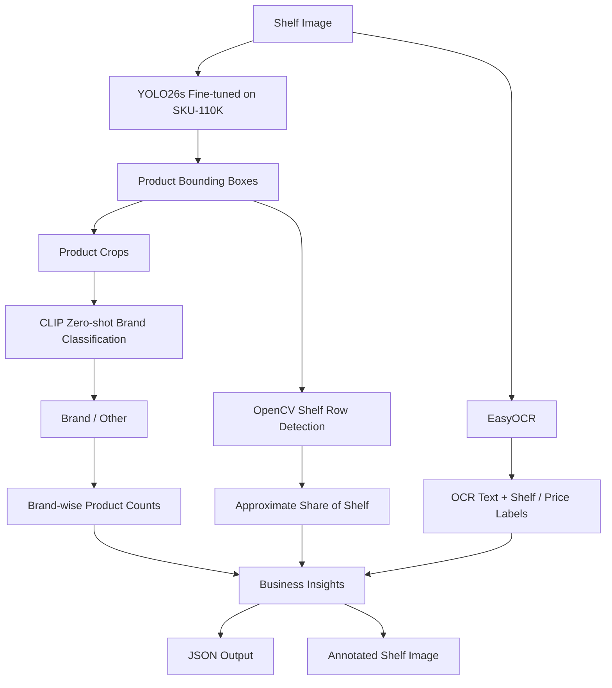

# Retail Shelf Analysis — Architecture

## End-to-end architecture



## Component responsibilities

### 1. Product detection

**Model:** YOLO26s fine-tuned on SKU-110K.

Input: shelf image.

Output: product bounding boxes and detector confidence.

SKU-110K is a single-class retail-object dataset. This stage answers: **Where are the visible product facings?** It does not determine the brand.

### 2. Brand classification

**Model:** `openai/clip-vit-base-patch32`.

Input: product crop.

Output: brand and brand confidence.

Multiple prompts are evaluated per brand. The current confidence threshold is `0.45`; predictions below this threshold are mapped to `Other`.

### 3. OCR

**Engine:** EasyOCR.

Input: shelf image.

Output: detected text, text bounding boxes and OCR confidence.

This is used for visible shelf labels, prices and package text.

### 4. Shelf-row analysis

OpenCV detects horizontal shelf-row structure. The current share-of-shelf metric is based on the horizontal width of detected product facings.

Interpretation: **approximate share of shelf / facing share**, not exact physical shelf area.

## Output layer

```text
outputs/
├── shelf_01.json
├── shelf_01_annotated.jpg
├── shelf_02.json
├── shelf_02_annotated.jpg
├── shelf_03.json
├── shelf_03_annotated.jpg
└── predictions.json
```

## Deployment flow

```text
Training
   |
YOLO26s + SKU-110K
   |
best.pt
   |
v
Shelf Image --> Product Detection
                    |
          +---------+---------+
          |                   |
          v                   v
       CLIP                 EasyOCR
     Brand ID             Shelf/price text
          |                   |
          +---------+---------+
                    |
                    v
             Shelf Analysis
                    |
             JSON + Image
```

## CPU / GPU strategy

```text
Training: GPU recommended
              |
              v
           best.pt
              |
              v
Inference: CPU supported; GPU preferred for low latency
```

## Production evolution

```text
Fine-tuned product detector
        +
SKU/brand reference gallery
        +
Fine-tuned brand classifier
        +
Calibrated OCR preprocessing
        +
Shelf segmentation
        +
Planogram reference data
        +
Confidence calibration
        +
ONNX/TensorRT deployment
```
